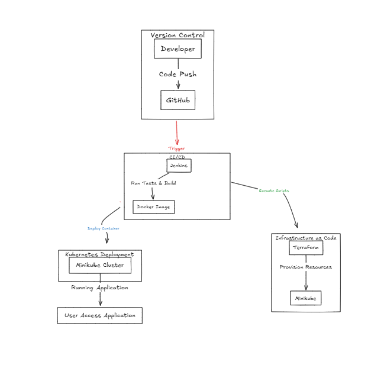

# Nginx Deployment using Terraform and Minikube



This README explains how to deploy an Nginx application on Kubernetes using Terraform with the provided `main.tf` file.

## Prerequisites
1. **Terraform**: Ensure Terraform is installed on your system. You can download it from [Terraform's official website](https://www.terraform.io/downloads.html).
2. **Kubernetes Cluster**: A running Kubernetes cluster accessible via `kubectl`.
3. **kubeconfig**: Ensure your `kubeconfig` file is correctly set up at `~/.kube/config` or update the `config_path` in the `main.tf` file.

## Deployment Steps

1. **Initialize Terraform**:
   Run the following command to initialize Terraform in the directory containing `main.tf`:
   ```bash
   terraform init
   ```

2. **Review the Plan**:
   Before applying the changes, review the execution plan:
   ```bash
   terraform plan
   ```

3. **Apply the Configuration**:
   Deploy the Nginx application by applying the Terraform configuration:
   ```bash
   terraform apply
   ```
   Confirm the action by typing `yes` when prompted.

4. **Verify the Deployment**:
   After the deployment is complete, verify the resources:
   ```bash
   kubectl get deployments
   kubectl get services
   ```

## Resources Created
- **Deployment**: An Nginx deployment with 2 replicas.
- **Service**: A NodePort service exposing the Nginx deployment on port 80.

## Cleanup
To remove the deployed resources, run:
```bash
terraform destroy
```
Confirm the action by typing `yes` when prompted.

## Notes
- The `main.tf` file configures the Kubernetes provider and defines the Nginx deployment and service.
- Ensure the Kubernetes cluster is accessible and the `kubeconfig` file is correctly configured. 
